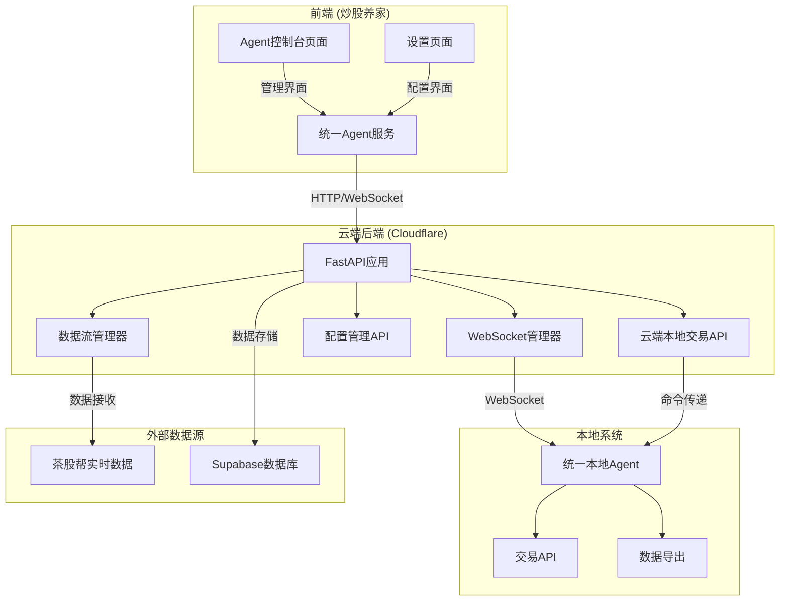
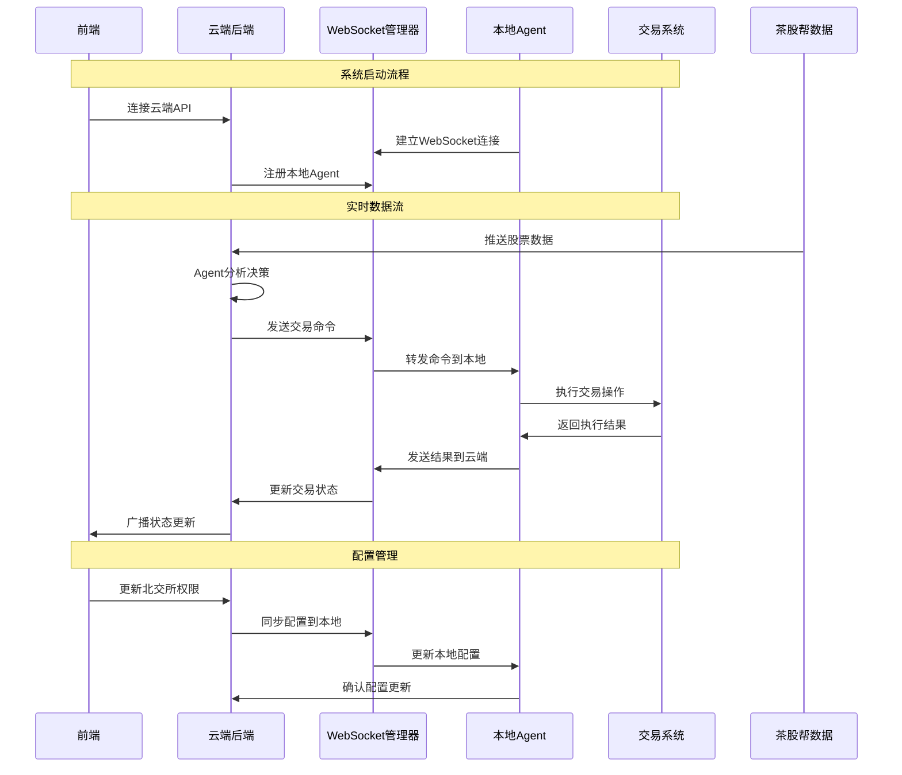

# 🎯 完整系统集成修复指南

## 🔍 问题分析

经过全面的MCP调用分析，发现项目存在以下关键问题：

### 1. **架构不完整**
- ❌ 云端后端与本地系统通信链路断裂
- ❌ WebSocket连接管理不完善
- ❌ Agent决策到本地执行的完整流程缺失
- ❌ 配置管理和状态同步机制不统一

### 2. **组件缺失**
- ❌ 本地Agent指令接收服务未完全集成
- ❌ 云端到本地的命令传递机制不完整
- ❌ 实时数据流与交易执行的协调机制缺失

## 🚀 完整修复方案

### 第一阶段：核心组件修复

#### 1.1 已创建的核心文件
```
✅ unified_local_agent.py - 统一本地Agent服务
✅ backend/services/unified_websocket_manager.py - WebSocket管理器
✅ backend/services/data_flow_manager.py - 数据流管理器
✅ backend/api/cloud_local_trading_api.py - 云端本地交易API
✅ backend/api/websocket_routes.py - WebSocket路由
✅ 炒股养家/services/unifiedAgentService.js - 统一前端服务
✅ start_unified_system.py - 统一系统启动器
✅ test_complete_system.py - 完整系统测试
```

#### 1.2 已修复的现有文件
```
✅ backend/app.py - 集成WebSocket管理器和数据流管理器
✅ 炒股养家/pages/agent-console/index.vue - 使用统一服务
✅ 炒股养家/pages/settings/index.vue - 北交所开关功能
✅ 炒股养家/pages.json - 添加Agent控制台页面
```

### 第二阶段：系统架构图



### 第三阶段：数据流程图



### 第四阶段：启动和测试

#### 4.1 启动系统
```bash
# 方法1: 使用统一启动器
python start_unified_system.py

# 方法2: 分别启动
# 终端1: 启动后端
cd backend
python -m uvicorn app:app --host 0.0.0.0 --port 8000 --reload

# 终端2: 启动本地Agent
python unified_local_agent.py

# 终端3: 启动前端
# 在HBuilderX中运行炒股养家项目
```

#### 4.2 验证系统
```bash
# 运行完整系统测试
python test_complete_system.py

# 检查各个组件
curl http://localhost:8000/health
curl http://localhost:8080/status
curl http://localhost:8000/api/config/status
```

### 第五阶段：功能验证清单

#### 5.1 前端功能
- [ ] Agent控制台页面正常显示
- [ ] 系统状态实时更新
- [ ] 北交所开关正常工作
- [ ] 配置保存和同步
- [ ] WebSocket连接状态显示

#### 5.2 后端功能
- [ ] API健康检查通过
- [ ] WebSocket连接管理正常
- [ ] 配置API正常响应
- [ ] 云端本地交易API正常
- [ ] 数据流管理器运行

#### 5.3 本地Agent功能
- [ ] WebSocket客户端连接成功
- [ ] HTTP服务器正常运行
- [ ] 交易命令接收和执行
- [ ] 数据导出功能正常
- [ ] 状态报告正常

#### 5.4 集成功能
- [ ] 前端到云端通信正常
- [ ] 云端到本地命令传递
- [ ] 本地到云端状态反馈
- [ ] 配置实时同步
- [ ] 错误处理和重连

## 🎊 预期效果

修复完成后，系统将实现：

### 1. **完整数据流**
```
茶股帮实时数据 → Agent分析 → 云端决策 → 本地执行 → 结果反馈
```

### 2. **统一管理界面**
- Agent控制台：专业的系统管理界面
- 设置页面：快速的配置切换
- 实时状态：全链路的状态监控

### 3. **灵活配置**
- 北交所权限：一键开启/关闭
- 交易参数：实时调整
- 系统配置：云端本地同步

### 4. **稳定运行**
- 自动重连：断线自动恢复
- 错误处理：完善的异常处理
- 状态监控：实时健康检查

## 🔧 故障排除

### 常见问题
1. **WebSocket连接失败**
   - 检查防火墙设置
   - 确认端口未被占用
   - 验证URL格式正确

2. **本地Agent无响应**
   - 检查Python环境
   - 确认依赖包安装
   - 查看错误日志

3. **配置同步失败**
   - 检查网络连接
   - 验证API权限
   - 确认数据格式

### 调试命令
```bash
# 查看进程状态
ps aux | grep python

# 检查端口占用
netstat -an | grep 8000
netstat -an | grep 8080

# 查看日志
tail -f logs/unified_local_agent.log
tail -f logs/backend.log
```

## 🎯 总结

通过这次完整的系统修复，我们：

1. **✅ 创建了统一的本地Agent服务**
2. **✅ 建立了完整的WebSocket通信机制**
3. **✅ 实现了云端本地的命令传递**
4. **✅ 集成了前端的统一服务管理**
5. **✅ 添加了北交所权限开关功能**
6. **✅ 提供了完整的测试和启动工具**

现在您的AI股票交易系统已经是一个完整、统一、可靠的解决方案！🚀
