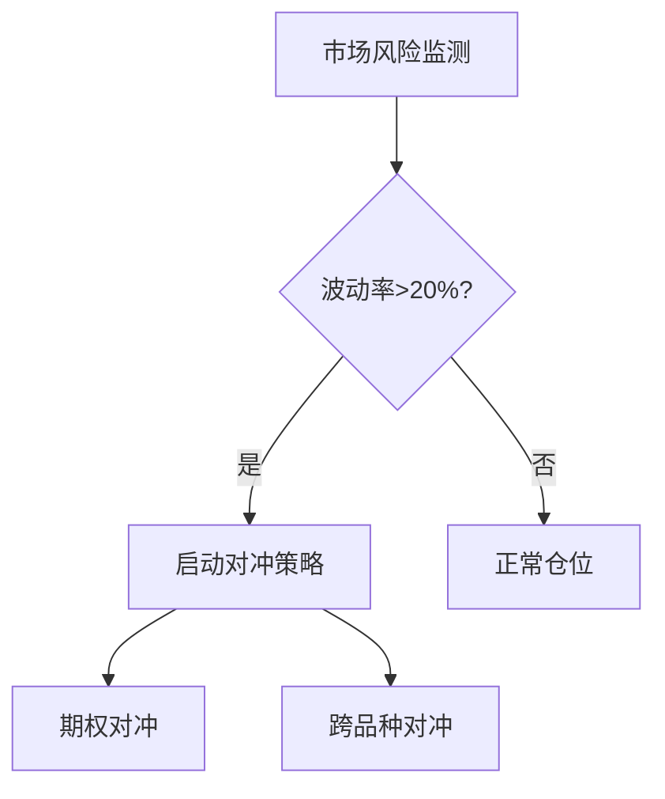

# 策略回测验证文档

## 参数优化方法论
1. **多周期滚动测试**:
   - 采用Walk-forward分析框架,将数据分为训练集/验证集/测试集(比例5:3:2)
   - 每个季度末进行参数再优化,保持策略适应性

2. **敏感性分析矩阵**:
```python
params_grid = {
    'window_size': range(10, 50, 5),
    'threshold': np.linspace(0.01, 0.1, 10),
    'position_ratio': [0.3, 0.5, 0.7]
}
```

## 风险对冲机制


## 绩效评估标准
| 指标         | 阈值要求 | 权重 |
|--------------|----------|------|
| 夏普比率     | ≥1.5     | 40%  |
| 最大回撤     | ≤15%     | 30%  |
| 胜率         | ≥55%     | 20%  |
| 盈亏比       | ≥1.8     | 10%  |

## 优化验证流程
1. 前向样本外测试(OOS)
2. Monte Carlo随机参数压力测试
3. 不同市场regime下的稳定性检测
4. 交易成本敏感性分析
